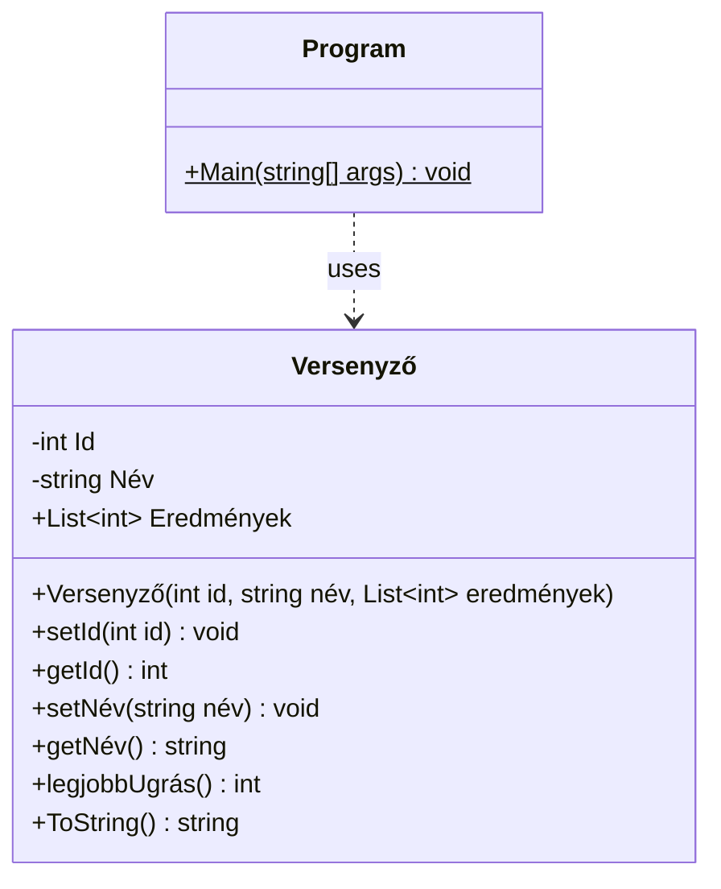

# VersenyEredmény

Készítsen egy C# konzolalkalmazást, amely egy távolugró verseny eredményeit olvassa be egy fájlból versenyzőként külön osztálypéldányba, és kérésre kiírja a versenyző listát és a győztest!

## Adatfájl formátuma

A versenyzők eredményei az alábbi formátumú szövegfájlban vannak tárolva:

```
#id név1 név2 … eredmény1 eredmény2 eredmény3 …
…
```

Példa (`verseny.txt`):

```
#12 Nagy Gábor 399 400 390
#7 Kis Csaba 403 392
#24 Juan Valerio 390 407 377 398
#3 Gipsz Jakab 390 375
#9 Kis Csaba 346 379 401
```

Egy sorban egy versenyző szerepel, a nevezési id-k nem sorrendben vannak. A név szavainak száma mindig 2, és az érvényes ugrások száma esetenként eltérő.

## A `Versenyző` osztály

Definiáljon egy `Versenyző` nevű osztályt, amely megvalósítja az `IComparable<Versenyző>` interfészt.

**Privát tagjai:**
- `Id` – egész szám
- `Név` – string

**Publikus tagjai:**

- `Eredmények` – egy `List<int>` referenciája

- **Paraméteres konstruktor:** paraméterként átveszi az `id`-t, a nevet, valamint egy `int` listában az eredményeket. A konstruktor a kapott paramétereket a megfelelő adattagok segítségével tárolja.

- **`setId` és `setNév` metódusok:** a paraméterként kapott értéket adják át a megfelelő privát tagoknak.

- **`getId` és `getNév` metódusok:** lekérdezik a megfelelő privát tagok értékeit.

- **`legjobbUgrás()`** – paraméterlistája void, visszatérési értéke a legjobb eredmény. Ha a lista üres, adjon vissza `-1`-et.

- **`ToString()`** – az `Object`-től örökölt metódus felüldefiniálása; a példányt a következő formában jeleníti meg:

  ```
  id név, eredményei: eredmény1, …, legjobb: legjobbEredmény
  ```

  Példa:
  ```
  12 Nagy Gábor, eredményei: 399, 400, 390, legjobb: 400
  ```

## A `Main` metódus

A `Main` metódusban:

1. Olvassa be a `verseny.txt` fájlt, és hozzon létre belőle egy `List<Versenyző>` listát úgy, hogy minden sorból egy `Versenyző` példányt hoz létre, és hozzáadja azt a listához.
2. Írja ki a konzolra a versenyzők adatait a `ToString()` használatával.


## Az alkalmazás osztálydiagramja


## Önálló feladatok

1. Oldja meg a paraméteres konstruktorban a lista értékeinek átadását mély másolás (deep-copy) eljárással: hozza létre az osztálytag `Eredmények` listát (`new`), és másolja át a paraméterként kapott lista adatait az osztálytag listába.

2. Írjon **paraméter nélküli konstruktort**.

3. Implementálja az `IComparable<Versenyző>` interfész `CompareTo` metódusát úgy, hogy az legyen a nagyobb versenyző, amelyiknek jobb a legjobb ugrása.

4. Rendezze sorba a listát a `List<Versenyző>.Sort()` metódusával.

5. Keresse meg a verseny győztesét, és írja ki a `ToString()` használatával.

6. Állapítsa meg, hogy vannak-e azonos nevű versenyzők a listában. Az azonos nevű párokat írja ki a konzolra.